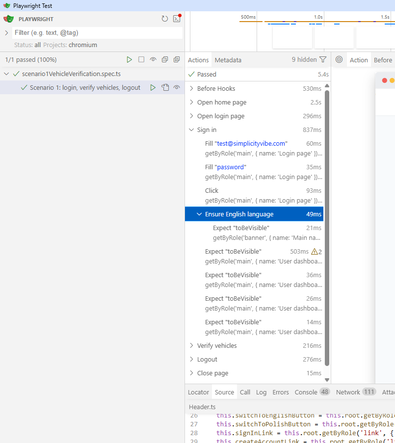

# SimPlayMcp
Simple play with Playwright MCP server

## Environment setup
- Copy `.env.example` to `.env`.
- Set `STANDARD_USER_PASSWORD` to the secret password used by test data.

## Page Object Model rules
- Every page object must extend `BasePage`, which guarantees `header` and `footer` components are present.
- `Header` defines all required header elements (navigation + auth actions) and exposes `expectCompleteVisible()` to verify completeness.
- `Footer` is a placeholder component for now; it still must be present on each page object via `BasePage`.
- `HomePage.create(page)` is the preferred factory; it navigates to the home URL and verifies the header is complete.
- Use `HomePage.SingInButtonClick()` to click the sign-in entry in a consistent way.

## Test reporting best practices
- Wrap each business action in `test.step(...)` so the Playwright report shows a clear, readable flow.
- Keep step names short and user-oriented (e.g., `Open home page`, `Sign in`, `Verify vehicles`, `Logout`).
- Use steps in page objects for cross-test actions; this keeps reports consistent across scenarios.
- Avoid noisy steps for low-value actions; focus on business intent and key checks.
- This structure produces a cleaner report timeline like the example in `testRun.png`.

