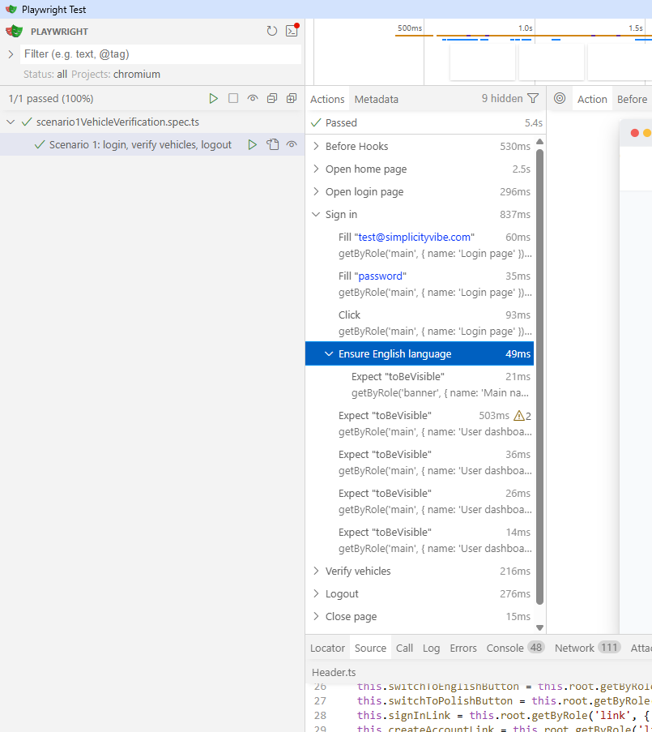

# SimPlayMcp
Simple play with Playwright MCP server

## Application under test
Application is a POC for single car or fleet management. POC stage make whole testing suite unstable and there are high risk of data model changes.

## Environment setup
- Copy `.env.example` to `.env`.
- Set `STANDARD_USER_PASSWORD` to the secret password used by test data.

## Page Object Model rules
- Every page object must extend `BasePage`, which guarantees `header` and `footer` components are present.
- `Header` defines all required header elements (navigation + auth actions) and exposes `expectCompleteVisible()` to verify completeness.
- `Footer` is a placeholder component for now; it still must be present on each page object via `BasePage`.
- `HomePage.create(page)` is the preferred factory; it navigates to the home URL and verifies the header is complete.
- Use `HomePage.SingInButtonClick()` to click the sign-in entry in a consistent way.

## Test reporting best practices
- Wrap each business action in `test.step(...)` so the Playwright report shows a clear, readable flow.
- Keep step names short and user-oriented (e.g., `Open home page`, `Sign in`, `Verify vehicles`, `Logout`).
- Use steps in page objects for cross-test actions; this keeps reports consistent across scenarios.
- Avoid noisy steps for low-value actions; focus on business intent and key checks.
- This structure produces a cleaner report timeline like the example in `testRun.png`.

## Test strategy
Application is builded with proper test pyramid. most of the cases are in the application repostory.
### Tests levels
- Unit test to cover complex bussiness logic on class level
- Integration test to cover contolers logic with spring context
- Contract tests to verify contract between frontend and backend
- E2E Playwright testing suite to verify system as ecosystem. This level should verfy:
   - application on functional level by mimicking user interaction
   - visual level of application by doing visual comparation between runs
   - communication error handling by mimicking backend errors and capability to restore frontend application after failure 
   - UI performance monitoring to identify significant decreese in performance on UI

## Test data strategy 
- Because of early stage of POC environemnt is cleand up regularly. 
- Each test should prepere required dataset during the test or before test execution.
- After test it's not mandatory to cleanup data which impact only one type of user
   - in long term users data should be created dynamicly via db connection in before test stage